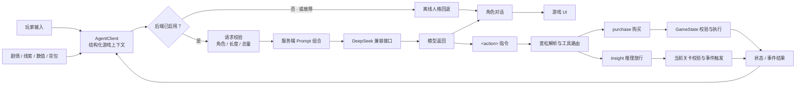

# 万象归墟：渡厄镇
*一个 AI 原生叙事游戏里的状态感知随行 Agent*

一个已上线、可离线试玩的 H5 叙事游戏。三种人格的随行 Agent 依据剧情、线索、背包、商城与清醒值理解此刻处境，用各自的口吻陪玩家推理，并在规则允许时发起受约束的游戏动作——兑换道具、放行关卡。积分、库存、关卡与剧情推进，始终由确定性游戏逻辑裁决。

> 网易 MiniGame 高校挑战赛参赛作品；8 人团队，本人担任队长 / 主策划；已上线可玩。仓库包含可离线试玩的 H5 游戏、随行 Agent 系统（拆成可单独测试的模块）与个人策划原件（`planning/`）；美术与视频归团队所有、仅作展示。


[本地离线试玩](web/index.html) · [在线观看宣传片](https://www.bilibili.com/video/BV1aAgb6FEtJ/) · [架构](docs/architecture.md) · [Agent 设计](docs/agent-design.md) · [安全模型](docs/security-model.md) · [策划作品](planning/README.md)

[](https://www.bilibili.com/video/BV1aAgb6FEtJ/)

<p align="center"><a href="https://www.bilibili.com/video/BV1aAgb6FEtJ/"><strong>▶ 点击封面在线观看完整宣传片（04:14）</strong></a></p>

---

## 随行 Agent 如何参与这局游戏

随行 Agent 不是悬浮在玩法之外的聊天框。每次开口前，游戏会把剧情进度、现场文本、线索、规则、清醒值、背包、商城和风险信号整理成一份结构化上下文；三种人格据此给出各自侧重的陪伴、提示与判断。

模型的一次返回同时走两条路径：

- **自然语言对话**直接呈现给玩家，保留角色口吻和叙事体验。
- **`<action>` 结构化指令**交给动作路由器——这是游戏在应用层自定义的受约束工具调用协议：模型可以请求 `purchase`（购买道具）或 `insight`（推理放行），但不能绕过规则直接改写状态。

工具请求只是「尝试行动」。`purchase` 最终由 [`GameState`](web/src/core/GameState.js) 核对商品、数量、积分和库存；`insight` 会核对当前关卡标识与判断结果。格式无效、关卡不匹配、条件未满足或积分不足时，游戏状态都不改变。执行结果再回注下一轮上下文，让模型看到刚刚发生了什么——「观察 → 请求工具 → 规则执行 → 结果反馈」就地闭合。



## 设计与取舍

游戏把语言模型放在它擅长的位置——理解不断变化的叙事情境、以鲜明人格回应、在合适时机提出行动；把积分、库存、关卡和剧情推进留给可验证的规则。这条分界线怎么落地，是这个项目里更值得看的部分。

### 每轮把游戏状态编译成上下文

`AgentClient.renderStateText()`（[web/src/core/AgentClient.js](web/src/core/AgentClient.js)）在每次对话前，把运行时状态按需拼成一段带【小标题】的上下文：当前进度与现场、已经历事件的逐条摘要、线索与规则、清醒值与积分、背包物品与用法、商城价格与剩余库存、红布 / 回溯 / 侵染等特殊态、本节点指令，以及推理关卡当前的判定标准。模型看到的不是整个游戏世界，而是业务代码替它选好、标注好的此刻状态——上下文里有什么，它的认知边界就到哪里。高危操作走 `risk_alert` 单独注入：只告诉模型「是什么操作」、不告诉后果，交给它按人格拦一句。

### 结构化输出即应用层工具调用

模型仍然只吐文本，应用从文本里抽出白名单指令，再映射到既有游戏函数——这是应用层自定义的受约束工具协议，不是供应商原生 Function Calling。[解析器](web/src/agent/responseParser.js)刻意宽松：容忍缺失的闭合标签、全角标点和不带标签的裸 JSON，抽不到就当没有，无效动作从可见正文里清掉、但不执行。放行与否则严格：`purchase` 交给 [`GameState.purchase()`](web/src/core/GameState.js) 核对商品 / 数量 / 积分 / 库存，`insight` 必须带成功标记并匹配当前活动关卡。

所以模型能提「买」或「想通了」，却不能自己把积分改成 999、也跳不过没满足的关卡。执行结果回注下一轮，模型据此确认——受控之下，AI 真的能兑换道具、放行剧情，直接参与资源博弈。

### 记忆：三层压缩 + 12 条滑动窗口

模型的「记忆」不靠堆历史，而是每轮从确定性状态重新压出来。一部分是三层结构化叙事状态——已过节点的逐条摘要（[`EVENT_DIGEST`](web/src/data/digest.js)）、当前节点原文、线索与规则清单；另一部分是只保留最近 12 条对白的短期滑动窗口。完整游戏状态每轮重新渲染，所以 token 成本可预测，模型的认知也和玩家实际进度严格对齐。

剧透被这套机制挡在门外：模型当下拥有的，永远只是玩家已经走到的地方——通关真相另存服务端的「复盘真相包」，仅在复盘节点才追加进 system prompt。没上向量库是有意的取舍：单人短会话、状态权威在本地，引入召回质量和跨会话一致性只是多一个故障面；代价是更早的对话细节会遗忘。这是单会话内的工作记忆，不是跨会话长期记忆，仓库也没有实现或声称 RAG。

### 让模型当推理裁判，用规则兜住死锁

有些剧情卡点要「玩家自己想通」才放行。`agentGate`（[web/src/story/StoryEngine.js](web/src/story/StoryEngine.js)）会挂起剧情，等模型在对话里判定玩家已经触及答案、回一个 `insight` 动作，才继续往下播。模型当裁判难免漏发信号，于是留了确定性兜底：后端不可用时离线自动放行；铭文扫描这类卡点按「译文长度 ≥ 40 字，或连问两轮」放行（[GameScene](web/src/scenes/GameScene.js)），免得玩家卡死在一个永远等不到的信号上。能交给模型判断的交给模型，判断可能失灵的地方用规则接住。

### 可信 Prompt，不可信对话

system prompt 走「公共底座 + 人格插件」分层（[server/prompts/](server/prompts/)）：一份[底座](server/prompts/Agent_System_Base.md)写世界观、行为边界、输入 / 输出协议与内容红线，三份人格文件写性格与表达，底座 + 一份人格 = 一套完整设定，支撑三个能力侧重不同的随行——雀舌爱抛想法、乌有对危险有直觉且会强行打断、枢衡惜字而只给有把握的结论——并行迭代。

这些提示词只在服务端由 [prompt-builder](server/agent/prompt-builder.js) 组合、随 Serverless 函数一起部署：不随静态站点下发到浏览器，也不能被客户端提交或覆盖，玩家从前端拿不到、也改不了防越狱与真相规则。（作为公开作品，它们在本仓库里是可读的；这里说的是运行时的前端边界，不是仓库可见性。）

抗注入分两层：浏览器只能提交 `user` / `assistant` 消息，[请求校验](server/agent/request-validator.js)在 API 结构层挡掉伪装的 `system` / `tool` / `developer` 角色和超量负载；自然语言层面的注入，再靠底座里的抗干扰条款加动作白名单兜底。抗幻觉则是底座里一条硬规则——一切以注入状态为准、玩家嘴上说的不作数，状态里没有的规则和道具就是没有。

### 坏天气不断线

真实模型路径上，客户端聊天请求串行——一次只放一条在途，在途期间不再发起第二个请求（[GameScene](web/src/scenes/GameScene.js) 的 `sending` 门）；网络失败或超时触发熔断（`AbortController` + `_downUntil` 冷却），冷却期内直接走离线人格台词，不让每句对话都卡在一个连不上的上游前面。离线人格是一套完整兜底：上游不可用时对话不中断，只是把回应从真模型换成本地台词。这条降级路径由离线用例覆盖，不是指望它别触发。

## 离线评测与回归

关键 Agent 行为被固化成 30 条 Node 原生离线用例（`npm test`，无需真实 Key）：特权角色被拒、超量负载稳定返回 `413`、残缺 `action` 解析为 `null` 而正文保留、未知动作与积分不足都不改状态、上游故障脱敏且前端熔断、离线模式给出非空回复、历史窗口收敛到最近一段……用例与预期见 [docs/evaluation.md](docs/evaluation.md)。`npm run verify` 再叠加敏感信息扫描、资源引用检查和公开边界检查。这些只验证确定性集成边界，不证明对白质量、生产吞吐或对每一种注入的免疫——该证明什么、不能证明什么，文档里写清楚了。

```bash
npm ci
npm run verify
```

## 本地试玩

默认离线运行，不请求模型，也不要求或保存访问者的 API Key。

```bash
python -m http.server 4173 --directory web
```

然后访问 `http://localhost:4173`（用任意静态文件服务器托管 `web/` 亦可）。

## 自行接入真实模型（可选）

仅供开发者部署自己的副本；Key 必须使用部署者自己的值，并只保存在服务端环境变量中。

1. 运行 `npm ci`。
2. 参考 `.env.example` 在部署平台配置 `DEEPSEEK_API_KEY` 等变量，不要提交真实 `.env`。
3. 把 [web/src/config/agent.js](web/src/config/agent.js) 的 `enabled` 显式改为 `true`；同源部署时 `baseUrl` 留空字符串。
4. 用 Netlify CLI 的 `netlify dev` 本地联调，或按 `netlify.toml` 部署。

仓库没有 BYOK 输入框，不把 Key 放进浏览器、URL 或 `localStorage`。更多边界见[安全模型](docs/security-model.md)。

## 仓库结构

```text
web/                 可运行的原生 H5 游戏
web/src/core/        GameState、AgentClient、存档与场景调度
web/src/agent/       模型输出的宽松解析
web/src/story/       剧情引擎与推理关卡放行
server/agent/        请求校验、Prompt 组合、模型适配与转发
server/prompts/      自行部署路径使用的运行时 Prompt（底座 + 三人格 + 复盘）
netlify/functions/   HTTP / Serverless 薄适配层
planning/            原始格式的个人策划作品
tests/               离线回归与工程门禁
docs/                架构、Agent、安全和评测说明
```

`planning/` 中包含完整故事、角色规则和复盘真相，阅读前请注意剧透。

## 关于这个仓库

作者在 8 人团队中担任队长 / 主策划，主导随行 Agent 的设计（人格 Prompt 架构、状态 ↔ 模型协议、记忆与门控机制）与本仓库的工程实现。仓库同时收录个人策划原件——设计入口见 [planning/README.md](planning/README.md)。

代码、个人剧情、Prompt 与策划文档采用 [MIT License](LICENSE)，音频采用 CC0。`web/assets/images/` 与 `showcase/trailer/` 为**团队版权所有、仅作品展示，不随代码许可证授权**，完整范围见 [ASSET_LICENSES.md](ASSET_LICENSES.md)。
