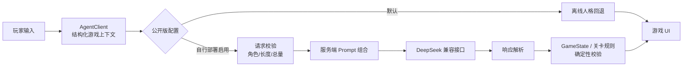

# 万象归墟：状态感知随行 Agent × H5 叙事游戏

一个可直接游玩的 H5 叙事游戏：三种人格的随行 Agent 根据剧情、线索、背包、商城与清醒值提供陪伴、引导和受约束的游戏动作。


[本地离线试玩](web/index.html) · [宣传片](showcase/trailer/万象归墟_宣传片.mp4) · [架构](docs/architecture.md) · [Agent 设计](docs/agent-design.md) · [策划作品](planning/README.md)

## 已实现的 Agent 工程能力

- 将剧情进度、现场文本、线索、规则、数值、背包、商城和风险信号组织为结构化上下文。
- 自行部署时，由服务端组合公共底座、人格和复盘 Prompt；浏览器不能提交特权角色消息。
- 宽松解析 `<state>` / `<action>` 结构化输出，兼容缺失闭合标签、全角标点和异常 JSON。
- 模型返回的是动作请求，不直接改写状态；购买由现有 `GameState` 校验商品、积分和库存，推理放行还会核对当前关卡。
- 提供请求超时、故障冷却和离线人格回退；公开版本默认不访问任何模型服务。
- 用 Netlify Function 封装可选模型接口，并以测试、敏感信息扫描、资源检查和公开边界检查组成 CI 门禁。



## 与 AI Agent 应用研发岗位的对应

这个项目把“叙事陪伴”拆成可落地的工程问题：游戏状态如何转成模型可用上下文、Prompt 与用户输入如何划分信任边界、模型输出如何安全接回既有业务状态、上游不可用时如何保持游戏可玩，以及这些行为如何用离线用例持续回归。

它展示的是一个小而完整的闭环：需求与人格策划 → Context / Prompt Engineering → API 适配 → 结构化输出 → 确定性执行 → 自动评测与降级。没有为贴关键词而声称未实现的 RAG、多智能体编排、模型训练或生产级高并发能力。

## 本地离线运行

公开配置位于 `web/src/config/agent.js`，`enabled` 默认为 `false`。离线试玩不会请求模型，也不会要求或保存访问者的 API Key。

```bash
python -m http.server 4173 --directory web
```

然后访问 `http://localhost:4173`。也可以使用任意静态文件服务器托管 `web/`。

## 可选：自行部署真实模型

这条路径仅供开发者部署自己的副本；Key 必须使用部署者自己的值，并只保存在服务端环境变量中。

1. 运行 `npm ci`。
2. 参考 `.env.example` 在部署平台配置 `DEEPSEEK_API_KEY` 等变量，不要提交真实 `.env`。
3. 将 `web/src/config/agent.js` 中的 `enabled` 显式改为 `true`；同源部署时 `baseUrl` 保持空字符串。
4. 用 Netlify CLI 的 `netlify dev` 本地联调，或按 `netlify.toml` 部署。

仓库没有 BYOK 输入框，不把 Key 放进浏览器、URL 或 `localStorage`。更多边界见 [安全模型](docs/security-model.md)。

## 验证

```bash
npm ci
npm run verify
```

`verify` 会依次运行 Node 原生测试、敏感信息扫描、资源引用检查和 Git 跟踪文件边界检查。评测用例与预期结果见 [docs/evaluation.md](docs/evaluation.md)。

## 仓库结构

```text
web/                 可运行的原生 H5 游戏
server/agent/        请求校验、Prompt 组合、模型适配与转发服务
server/prompts/      自行部署路径使用的运行时 Prompt
netlify/functions/   薄适配层
planning/            原始格式的个人策划作品
showcase/trailer/    唯一保留的最终宣传片
scripts/             安全、资源与公开边界检查
tests/               离线回归与工程门禁
docs/                架构、Agent、安全和评测说明
```

`planning/` 中包含完整故事、角色规则和复盘真相，阅读前请注意剧透。

## 已知边界

- 公开版本只展示离线人格，不提供公共模型额度或访客 Key 输入。
- 当前记忆方案面向单人、短会话叙事，不是跨会话长期记忆。
- Prompt 注入只能通过信任分层、角色限制和确定性执行降低风险，不能宣称彻底解决。
- 仓库未实现 RAG、任务型多 Agent 编排、SFT / RL、生产鉴权、分布式限流或高并发压测。

## 许可

代码、个人剧情、Prompt 与策划文档采用 [MIT License](LICENSE)。音频采用 CC0。

`web/assets/images/` 与 `showcase/trailer/` 不属于 MIT 授权范围：

**团队版权所有、仅作品展示，不随代码许可证授权**

完整范围见 [ASSET_LICENSES.md](ASSET_LICENSES.md)。
