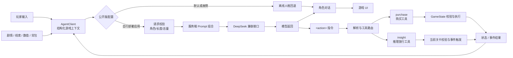

# 万象归墟：状态感知随行 Agent × H5 叙事游戏

一个可直接游玩的 H5 叙事游戏：三种人格的随行 Agent 根据剧情、线索、背包、商城与清醒值提供陪伴、引导和受约束的游戏动作。


[本地离线试玩](web/index.html) · [宣传片](showcase/trailer/万象归墟_宣传片.mp4) · [架构](docs/architecture.md) · [Agent 设计](docs/agent-design.md) · [策划作品](planning/README.md)

## 随行 Agent 如何参与游戏

随行 Agent 不是悬浮在玩法之外的聊天框。每次交流前，游戏会把剧情进度、现场文本、线索、规则、清醒值、背包、商城和风险信号整理成结构化上下文；不同人格据此给出不同侧重的陪伴、提示与判断。

模型的一次返回同时走两条路径：

- 自然语言对话直接呈现给玩家，保留角色口吻和叙事体验。
- `<action>` 中的结构化指令交给动作路由器。这是游戏定义的应用层 Agent 工具调用协议：模型可以请求 `purchase`（购买道具）或 `insight`（通过推理关卡），但不能绕过游戏规则直接改写状态。

工具请求只是“尝试行动”。`purchase` 最终由现有 `GameState` 核对商品、数量、积分和库存；`insight` 会核对当前关卡标识与判断结果。格式无效、关卡不匹配、条件未满足或积分不足时，游戏状态都不会改变。执行结果会进入后续上下文，使下一轮回应能看到刚刚发生了什么。

公开版默认使用离线人格回退，不访问模型服务；自行部署时，服务端负责组合公共底座、人格与复盘 Prompt，并限制输入角色、长度和总量。请求超时或上游故障也会回退到本地回应，主线玩法不会因此中断。



## 与 AI Agent 应用

《万象归墟》把语言模型放在它擅长的位置：理解不断变化的叙事情境，以鲜明人格回应玩家，并在合适时机提出行动；积分、库存、关卡和剧情推进仍由可验证的游戏规则裁决。由此形成一条完整循环：

**观察游戏状态 → 组织 Context / Prompt → 生成对话与工具请求 → 确定性执行 → 将结果反馈给下一轮。**

这种分工让 Agent 的表达可以开放，行动边界却保持清晰。宽松解析负责接住模型输出中的标签缺失、全角标点和异常 JSON；严格执行负责拒绝越权或不满足条件的动作；离线用例持续检查人格、上下文、工具调用和降级路径。它首先服务于玩法，也让模型、应用状态与既有规则之间的协作过程能够被观察、复现和验证。

## 本地离线运行

公开配置位于 `web/src/config/agent.js`，`enabled` 默认为 `false`。离线试玩不会请求模型，也不会要求或保存访问者的 API Key。

```bash
python -m http.server 4173 --directory web
```

然后访问 `http://localhost:4173`。也可以使用任意静态文件服务器托管 `web/`。

## 可选：自行部署真实模型

这条路径仅供开发者部署自己的副本；Key 必须使用部署者自己的值，并只保存在服务端环境变量中。

1. 运行 `npm ci`。
2. 参考 `.env.example` 在部署平台配置 `DEEPSEEK_API_KEY` 等变量，不要提交真实 `.env`。
3. 将 `web/src/config/agent.js` 中的 `enabled` 显式改为 `true`；同源部署时 `baseUrl` 保持空字符串。
4. 用 Netlify CLI 的 `netlify dev` 本地联调，或按 `netlify.toml` 部署。

仓库没有 BYOK 输入框，不把 Key 放进浏览器、URL 或 `localStorage`。更多边界见 [安全模型](docs/security-model.md)。

## 验证

```bash
npm ci
npm run verify
```

`verify` 会依次运行 Node 原生测试、敏感信息扫描、资源引用检查和 Git 跟踪文件边界检查。评测用例与预期结果见 [docs/evaluation.md](docs/evaluation.md)。

## 仓库结构

```text
web/                 可运行的原生 H5 游戏
server/agent/        请求校验、Prompt 组合、模型适配与转发服务
server/prompts/      自行部署路径使用的运行时 Prompt
netlify/functions/   薄适配层
planning/            原始格式的个人策划作品
showcase/trailer/    唯一保留的最终宣传片
scripts/             安全、资源与公开边界检查
tests/               离线回归与工程门禁
docs/                架构、Agent、安全和评测说明
```

`planning/` 中包含完整故事、角色规则和复盘真相，阅读前请注意剧透。

## 已知边界

- 公开版本只展示离线人格，不提供公共模型额度或访客 Key 输入。
- 当前记忆方案面向单人、短会话叙事，不是跨会话长期记忆。
- Prompt 注入只能通过信任分层、角色限制和确定性执行降低风险，不能宣称彻底解决。
- 仓库未实现 RAG、任务型多 Agent 编排、SFT / RL、生产鉴权、分布式限流或高并发压测。

## 许可

代码、个人剧情、Prompt 与策划文档采用 [MIT License](LICENSE)。音频采用 CC0。

`web/assets/images/` 与 `showcase/trailer/` 不属于 MIT 授权范围：

**团队版权所有、仅作品展示，不随代码许可证授权**

完整范围见 [ASSET_LICENSES.md](ASSET_LICENSES.md)。
